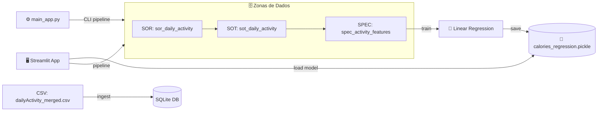

# 🏗️ Arquitetura Técnica

> **📚 Documentação Completa**: Veja o [README.md](README.md) para informações detalhadas.

## 🔄 Fluxo de Dados

## 📋 Pipeline de Execução

### 🎯 **Via Interface Web** (`app.py`)
1. **Setup**: Cria SQLite + tabelas via `core/data/*.sql`
2. **Ingest**: Carrega CSV → `SOR` (dados brutos)
3. **Transform**: `SOR` → `SOT` (dados limpos) → `SPEC` (features ML)
4. **Train**: Treina regressão linear nas features
5. **Save**: Serializa modelo → `model/calories_regression.pickle`
6. **Predict**: Usa modelo salvo para novas predições

### ⚙️ **Via CLI** (`main_app.py`)
- Executa pipeline completo automaticamente
- Retorna caminho do modelo + métricas
- Ideal para automação e integração

## 🗂️ Camadas de Dados

| Camada   | Descrição                          | Exemplo                                 |
| -------- | ---------------------------------- | --------------------------------------- |
| **SOR**  | Sistema de Registro (dados brutos) | CSV original com datas como texto       |
| **SOT**  | Fonte da Verdade (dados limpos)    | Datas convertidas, colunas padronizadas |
| **SPEC** | Features para ML                   | Variáveis derivadas (steps_per_km)      |

## 🔧 Componentes Técnicos

- **🗄️ Database**: SQLite com SQLAlchemy ORM
- **🧹 ETL**: Pipeline modular em Python
- **🤖 ML**: Scikit-learn Linear Regression
- **🖥️ Interface**: Streamlit web app
- **📊 Versionamento**: Git + pickle serialization
