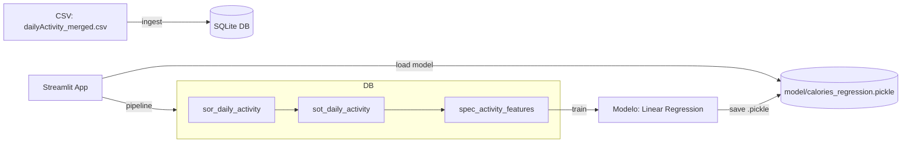

# 🏃‍♂️ Fitbit Project - Predição de Calorias com Machine Learning

Um projeto completo de análise e predição de calorias baseado em dados de atividade física do Fitbit, utilizando SQLAlchemy, Streamlit e Machine Learning.

## 📋 Índice

- [Visão Geral](#-visão-geral)
- [Funcionalidades](#-funcionalidades)
- [Arquitetura](#-arquitetura)
- [Instalação](#-instalação)
- [Como Usar](#-como-usar)
- [Estrutura de Arquivos](#-estrutura-de-arquivos)
- [Modelo de Dados](#-modelo-de-dados)
- [API Reference](#-api-reference)
- [Troubleshooting](#-troubleshooting)
- [Contribuição](#-contribuição)

## 🎯 Visão Geral

Este projeto implementa um pipeline completo de ciência de dados para predição de calorias queimadas com base em métricas de atividade física. Utiliza:

- **Regressão Linear** para predição de calorias
- **SQLite** com SQLAlchemy para gerenciamento de dados
- **Streamlit** para interface web interativa
- **Arquitetura em camadas** (SOR, SOT, SPEC) para organização dos dados

### 🎯 Objetivo
Prever o número de calorias queimadas com base em:
- Total de passos
- Distância percorrida
- Minutos de atividade moderada/vigorosa
- Minutos ativos totais
- Minutos sedentários
- Passos por quilômetro

## ⭐ Funcionalidades

### Interface Web (Streamlit)
- ✅ **Treinar Modelo**: Executa pipeline completo de ETL e treinamento
- ✅ **Usar Modelo Salvo**: Carrega modelo treinado para predições
- ✅ **Visualização de Métricas**: R², MAE para treino e validação
- ✅ **Estatísticas das Predições**: Min, média e máximo das calorias previstas

### Pipeline de Dados
- 🔄 **ETL Automatizado**: SOR → SOT → SPEC
- 🗄️ **Gestão de Banco**: Criação automática de esquemas
- 🧹 **Limpeza de Dados**: Tratamento de valores ausentes
- 📊 **Feature Engineering**: Criação de variáveis derivadas

### Machine Learning
- 🤖 **Regressão Linear**: Modelo interpretável e eficiente
- 📈 **Validação**: Split treino/validação (80/20)
- 💾 **Serialização**: Salvamento em formato .pickle
- 📊 **Métricas**: R² Score e Mean Absolute Error

## 🏗️ Arquitetura



### Camadas de Dados

1. **SOR (System of Record)**: Dados brutos do CSV
2. **SOT (Source of Truth)**: Dados limpos e padronizados
3. **SPEC (Model Spec)**: Features prontas para ML

## 🚀 Instalação

### Pré-requisitos
- Python 3.8+
- pip

### Dependências
```bash
pip install streamlit pandas scikit-learn sqlalchemy
```

### Clone do Repositório
```bash
git clone https://github.com/luandersonarlindo/fitbit-project.git
cd fitbit-project/fitbit-project-sqlalchemy
```

## 💻 Como Usar

### 🎯 Método Simples (Recomendado)

```bash
# Interface Web (Streamlit)
python run_app.py

# ou Pipeline CLI
python run_app.py --mode cli
```

### 1. Interface Web Completa

```bash
# Navegar para pasta src e executar
cd src
streamlit run app.py
```

Acesse: http://localhost:8501

#### Primeira Execução:
1. Selecione **"Treinar modelo"**
2. Aguarde o pipeline completar
3. Visualize as métricas do modelo

#### Execuções Subsequentes:
1. Selecione **"Usar modelo salvo (.pickle)"**
2. Veja as predições instantaneamente

### 2. Linha de Comando

```python
import sys
sys.path.append('src')
from main_app import run_pipeline

model_path, metrics = run_pipeline()
print(f"Modelo salvo em: {model_path}")
print(f"Métricas: {metrics}")
```

### 3. Uso Direto do Modelo

```python
from core.predict import predict_from_pickle
import pandas as pd

# Seus dados
data = {
    'total_steps': 10000,
    'total_distance_km': 7.5,
    'mvpa_minutes': 55,
    'active_minutes': 200,
    'sedentary_minutes': 500,
    'steps_per_km': 1333
}

df = pd.DataFrame([data])
prediction = predict_from_pickle("model/calories_regression.pickle", df)
print(f"Calorias previstas: {prediction[0]:.0f}")
```

## 📁 Estrutura de Arquivos

```
fitbit-project-sqlalchemy/
├── � README.md                     # Documentação principal
├── ⚙️ config.py                     # Configurações de caminhos
├── 🚀 run_app.py                    # Executor principal
│
├── � data/                         # Dados do projeto
│   └── dailyActivity_merged.csv     # Dataset original
│
├── �️ database/                     # Bancos de dados
│   └── fitbit.db                    # SQLite (gerado automaticamente)
│
├── 📚 docs/                         # Documentação
│   ├── architecture.md             # Diagramas de arquitetura  
│   ├── data_model.md               # Especificação do modelo de dados
│   └── RESUMO.MD                   # Resumo técnico dos arquivos
│
├── 🧠 model/                        # Modelos treinados
│   └── calories_regression.pickle   # Modelo de regressão linear
│
├── 📱 notebooks/                    # Jupyter Notebooks
│   ├── Analise_Frequencia_Atividades.ipynb
│   ├── IA___Aula_02___Modelo_Reg_Linear.ipynb
│   └── IA___Aula_02___Modelo_Reg_Linear (1).ipynb
│
└── 💻 src/                          # Código fonte
    ├── app.py                      # Interface Streamlit
    ├── main_app.py                 # Pipeline via CLI
    │
    └── core/                       # Módulos principais
        ├── db.py                   # Gestão de banco de dados
        ├── etl.py                  # Pipeline ETL
        ├── train.py                # Treinamento do modelo
        ├── predict.py              # Predições
        │
        └── data/                   # Schemas SQL
            ├── sor_daily_activity.sql      # Schema SOR
            ├── sot_daily_activity.sql      # Schema SOT
            └── spec_activity_features.sql  # Schema SPEC
```

## 🗄️ Modelo de Dados

### SOR - `sor_daily_activity`
**Grão**: 1 linha por (`user_id`, `activity_date`)  
**Descrição**: Dados brutos do CSV

| Coluna              | Tipo    | Descrição          |
| ------------------- | ------- | ------------------ |
| `user_id`           | INTEGER | ID do usuário      |
| `activity_date_txt` | TEXT    | Data da atividade  |
| `total_steps`       | INTEGER | Total de passos    |
| `total_distance`    | REAL    | Distância total    |
| `calories`          | INTEGER | Calorias queimadas |

### SOT - `sot_daily_activity`
**Grão**: 1 linha por (`user_id`, `activity_date`)  
**Descrição**: Dados tratados e padronizados

| Coluna              | Tipo    | Descrição                           |
| ------------------- | ------- | ----------------------------------- |
| `user_id`           | INTEGER | ID do usuário                       |
| `activity_date`     | DATE    | Data padronizada (YYYY-MM-DD)       |
| `total_steps`       | INTEGER | Total de passos                     |
| `total_distance_km` | REAL    | Distância em km                     |
| `mvpa_minutes`      | INTEGER | Minutos atividade moderada/vigorosa |
| `active_minutes`    | INTEGER | Total minutos ativos                |
| `sedentary_minutes` | INTEGER | Minutos sedentários                 |
| `calories`          | INTEGER | Calorias queimadas                  |

### SPEC - `spec_activity_features`
**Grão**: 1 linha por (`user_id`, `activity_date`)  
**Descrição**: Features para Machine Learning

| Coluna              | Tipo    | Descrição                            |
| ------------------- | ------- | ------------------------------------ |
| `user_id`           | INTEGER | ID do usuário                        |
| `activity_date`     | DATE    | Data da atividade                    |
| `total_steps`       | INTEGER | Total de passos                      |
| `total_distance_km` | REAL    | Distância em km                      |
| `mvpa_minutes`      | INTEGER | Minutos atividade moderada/vigorosa  |
| `active_minutes`    | INTEGER | Total minutos ativos                 |
| `sedentary_minutes` | INTEGER | Minutos sedentários                  |
| `steps_per_km`      | REAL    | **Passos por km (feature derivada)** |
| `calories`          | INTEGER | **Target: Calorias queimadas**       |

## 🔧 API Reference

### Core Modules

#### `core.db`
```python
def create_database(engine_url="sqlite:///fitbit.db")
    """Cria banco SQLite com tratamento de erros"""

def exec_sql_files(engine, folder="core/data")
    """Executa scripts SQL para criar tabelas"""
```

#### `core.etl`
```python
def load_csv_to_sor(engine, csv_path)
    """Carrega CSV para tabela SOR"""

def transform_to_sot(engine)
    """Transforma SOR → SOT"""

def transform_to_spec(engine)
    """Transforma SOT → SPEC"""
```

#### `core.train`
```python
def train_and_save(engine, model_path="model/calories_regression.pickle")
    """Treina modelo e salva .pickle"""
    # Returns: (model_path, metrics)
```

#### `core.predict`
```python
def predict_from_pickle(pickle_path, df_spec)
    """Carrega modelo e faz predições"""
    # Returns: numpy array com predições
```

## 🚨 Troubleshooting

### Erro: "PermissionError: arquivo sendo usado"
```bash
# Pare todos os processos Python
taskkill /f /im python.exe

# Remova o banco problemático
rm fitbit.db

# Execute novamente
streamlit run app.py
```

### Erro: "Modelo não encontrado"
1. Execute primeiro o **"Treinar modelo"** no Streamlit
2. Verifique se existe `model/calories_regression.pickle`

### Erro: "Streamlit não encontrado"
```bash
pip install streamlit
```

### Porta em uso
```bash
# Use porta alternativa
streamlit run app.py --server.port 8502
```

## 📊 Métricas de Performance

O modelo de regressão linear típico apresenta:
- **R² Score**: ~0.85-0.95 (85-95% da variância explicada)
- **MAE**: ~200-400 calorias (erro médio absoluto)

### Features Mais Importantes
1. `active_minutes` - Minutos ativos totais
2. `total_steps` - Total de passos
3. `mvpa_minutes` - Atividade moderada/vigorosa
4. `total_distance_km` - Distância percorrida

## 🤝 Contribuição

### Como Contribuir
1. Fork o projeto
2. Crie uma branch (`git checkout -b feature/AmazingFeature`)
3. Commit suas mudanças (`git commit -m 'Add AmazingFeature'`)
4. Push para a branch (`git push origin feature/AmazingFeature`)
5. Abra um Pull Request

### Desenvolvimento Local
```bash
# Clone e setup
git clone https://github.com/luandersonarlindo/fitbit-project.git
cd fitbit-project/fitbit-project-sqlalchemy

# Execute testes (se disponível)
python -m pytest

# Execute linting
flake8 core/ app.py
```

## 📜 Licença

Este projeto está sob a licença MIT. Veja o arquivo `LICENSE` para detalhes.

## 👥 Autores

- **Luanderson Arlindo** - *Desenvolvimento inicial* - [luandersonarlindo](https://github.com/luandersonarlindo)

## 🙏 Agradecimentos

- Dados do Fitbit via Kaggle
- Comunidade Streamlit
- Documentação SQLAlchemy
- Scikit-learn team

---

⭐ Se este projeto foi útil para você, considere dar uma estrela no GitHub!
