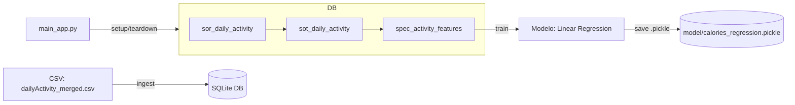

# Architecture

**Pipeline** (executado por `main_app.py`):
1. Cria o SQLite e as tabelas via `core/data/*.sql`  
2. Carrega o CSV para `SOR`  
3. Constrói `SOT` e `SPEC`  
4. Treina o modelo e salva `model/calories_regression.pickle`  
5. Dropa o database (remove o arquivo `.sqlite`)
